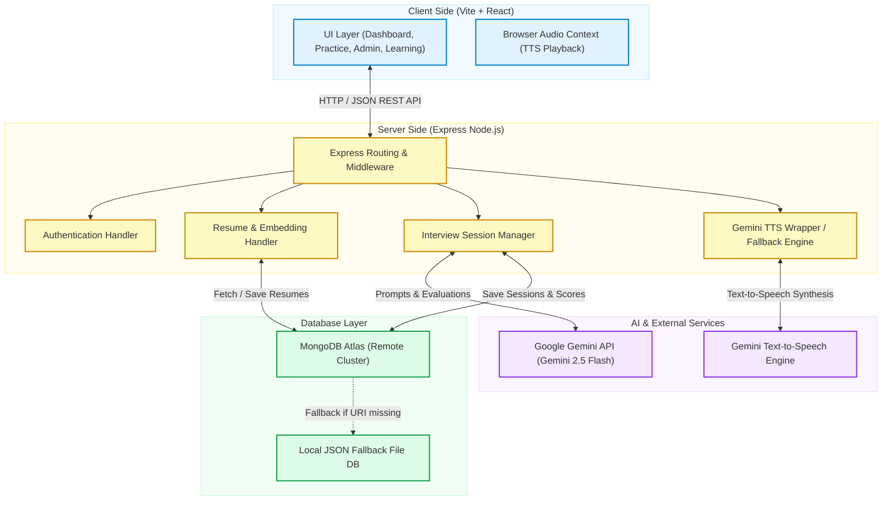
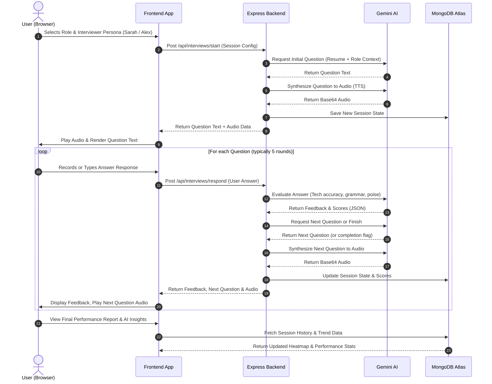

# 🤖 Automated Talent Evaluator

An elite, production-grade AI-powered mock interview and skill assessment platform. It leverages **Google Gemini 2.5 Flash** for dual-interviewer personas, deep semantic resume parsing, voice-synthesized interview interactions, and real-time analytical evaluation of candidate responses.

---

## 📐 Platform Architecture

The platform uses a decoupled React SPA frontend and an Express Node.js backend. Data is persisted in a remote MongoDB Atlas database, falling back to a local JSON file-based database if remote credentials are not provided.



---

## 🔄 End-to-End Interview Workflow

The sequence below illustrates a voice-based interactive session. Dual AI interviewers generate context-aware questions tailored to the candidate's resume and real-time performance.



---

## 🛠️ Technology Stack

| Layer | Technology | Purpose |
| :--- | :--- | :--- |
| **Frontend UI** | React 19, TypeScript, Vite 6 | Rapid, modular UI rendering and bundle compilation |
| **Styling** | CSS Vanilla, Tailwind CSS v4 | Harmonious, responsive layouts and premium dark gradients |
| **Animation** | Motion (Framer Motion) | Micro-interactions, slide transitions, and interactive components |
| **Data Viz** | Recharts | Real-time skill radar charts, scores, and activity heatmaps |
| **Backend API** | Node.js, Express, TSX | Restful routes, session state management, and media streaming |
| **Database** | MongoDB Atlas / Local JSON | Flexible documents for resumes, users, sessions, and leaderboards |
| **AI / TTS Engine** | `@google/genai` (Gemini 2.5 Flash) | AI persona prompts, response evaluation, and audio synthesis |
| **DevOps** | Docker, Docker Compose, Render | Seamless containerization and cloud hosting |

---

## 📖 Feature Walkthrough & System Flow

### 1. User Dashboard & Heatmap Tracking
The landing page displays immediate visual metrics of the user's progress. A timezone-aware calendar activity heatmap visualizes session volume over the past year, while radar charts break down structural skills (grammar, poise, technical explanation, and confidence).

### 2. Tailored Interview Personas
Candidates choose between distinct interviewer styles to practice for different interview settings:
* **Sarah (HR Manager)**: Friendly, conversational tone focused on behavioral cues, speech clarity, and company culture alignment.
* **Alex (Technical Lead)**: Direct, structured, and deep-dives into code accuracy, system design, and technical explanations.

### 3. Smart Resume Contextualization
The platform allows users to upload, clear, and update PDF or text resumes. The backend extracts and embeds resume metrics, dynamically tailoring AI-generated interview questions to match the candidate's actual background and experience.

### 4. Interactive Voice-Based Question Loops
Using the browser's web audio context and Gemini's TTS, questions are spoken to the candidate. The candidate responds using text input or voice recording. The response is graded on:
* **Poise & Tone**: Confidence and phrasing suitability.
* **Grammar**: Structural correctness and fluency.
* **Technical Explanations**: Accuracy, depth, and terminology usage.

---

## 🚀 Local Development Setup

### Prerequisites
* Node.js 20+
* npm
* A MongoDB Atlas Database (or local database)
* A Google Gemini API Key

### Step 1: Clone & Install Dependencies
```bash
git clone https://github.com/Sabari-D/MockAgent_AI.git
cd MockAgent_AI
npm install
```

### Step 2: Environment Configuration
Create a `.env` file in the root directory:
```env
GEMINI_API_KEY=your_gemini_api_key
MONGODB_URI=mongodb+srv://<username>:<password>@cluster.mongodb.net/
MONGODB_DB=Mock_Agent
PORT=3000
APP_URL=http://localhost:3000
NODE_ENV=production
```

### Step 3: Run Locally (Dev Mode)
To run with hot-reload for frontend and backend files:
```bash
npm run dev
```

### Step 4: Run Locally (Production Build)
To build and run the optimized production bundle:
```bash
npm run build
npm start
```
Open `http://localhost:3000` in your web browser.

---

## 🐳 Docker Deployment

### Docker Compose
Run both the application and environment in a secure local container:
```bash
docker compose up --build -d
```
To stop the services:
```bash
docker compose down
```

---

## 🌐 Cloud Deployment (Render & Vercel)

### Deploying to Render
1. Push this repository to your GitHub account (`Sabari-D/MockAgent_AI`).
2. Navigate to your [Render Dashboard](https://dashboard.render.com) and create a **Web Service**.
3. Link your GitHub repository.
4. Set the following Build & Runtime parameters:
   * **Runtime**: `Node`
   * **Build Command**: `npm ci && npm run build`
   * **Start Command**: `npm start`
5. Under **Environment Variables**, add:
   * `GEMINI_API_KEY` (Your Gemini API Key)
   * `MONGODB_URI` (Your MongoDB Atlas Connection string)
   * `MONGODB_DB` (Your database name, e.g. `Mock_Agent`)
   * `APP_URL` (Your Render deployment URL)
   * `NODE_ENV` (`production`)
6. Click **Deploy Web Service**.

### Deploying to Vercel (using Docker)
Add a `vercel.json` file in the root:
```json
{
  "version": 3,
  "builds": [
    { "src": "Dockerfile", "use": "@vercel/docker" }
  ]
}
```
Deploy the project via the Vercel dashboard and add the matching environment variables.

---

## 📄 License
This project is licensed under the MIT License - see the [LICENSE](LICENSE) file for details.
